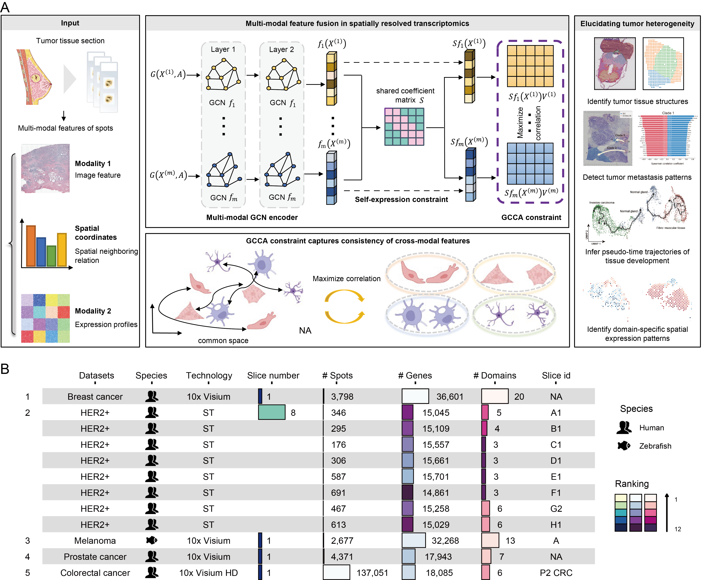

# Facilitating the decoding of tumor spatial heterogeneity with Falcon

## Overview
 Effectively integrating multi-modal SRT data from tumor tissues can create comprehensive spatial transcriptomic landscapes. To this end, we propose a computational method called Falcon, which maps gene expression, spatial location, and histology information into a common low-dimensional space, facilitating the precise decoding of tumor spatial heterogeneity and the tumor microenvironment.



## Requirements and Installation
[](https://pypi.org/project/anndata/) [](https://pypi.org/project/pandas/) [](https://pypi.org/project/numpy/1.22.0/) [](https://pypi.org/project/scanpy/) [](https://github.com/scikit-learn/scikit-learn/)  [](https://pytorch.org/get-started/locally/) [](https://pypi.org/project/matplotlib/) [](https://pypi.org/project/scipy/1.9.1/) 

### Create and activate Python environment
It is recommended to use a Python version  `3.9`. We recommend using Anaconda, and then you can create a new environment.
```
conda create -n Falcon python=3.9
conda activate Falcon
```

### Install PyTorch
We developed Falcon in a CUDA 11.8 environment.
```
pip install torch==2.1.0+cu118 --extra-index-url https://download.pytorch.org/whl/cu118
```

### Install other requirements
```
pip install -r requirements.txt
```
### Install Falocn
```
git clone https://github.com/zhangdaoliang/Falcon.git

cd Falcon

python setup.py build

python setup.py install --user
```

## Datasets
All datasets used in this paper are available for download from the following websites. 

1. 10x Visium human breast cancer data: https://support.10xgenomics.com/spatial-gene-expression/datasets/1.1.0/V1_Breast_Cancer_Block_A_Section_1.

2. ST human HER2-positive breast cancer: https://github.com/almaan/her2st.

3. 10x Visium human prostate cancer data: https://www.10xgenomics.com/datasets/human-prostate-cancer-adenocarcinoma-with-invasive-carcinoma-ffpe-1-standard-1-3-0.

4. 10x Visium zebrafish melanoma data: https://www.ncbi.nlm.nih.gov/geo/query/acc.cgi?acc=GSE159709.

5. 10x Visium HD human colorectal cancer data: https://www.10xgenomics.com/products/visium-hd-spatial-gene-expression/dataset-human-crc.

## Tutorials
All tutotials were ran on an Intel(R) Xeon(R) Gold 6258R CPU and an NVIDIA Quadro GV100 GPU.

Reproduce the result of article.

- breast cancer:
  ```python  
  python  Breast_cancer.py 
  ```

- HER2-positive breast cancer:

  ```python  
  python  run_E1.py
  ```

- prostate cancer:

  ```python  
  python run_prostate_FFPA.py
  ```

- melanoma:

  ```python  
  python fish.py
  ```

## Contact
Feel free to submit an issue or contact us at gaorui@sdu.edu.cn for problems about the packages.
